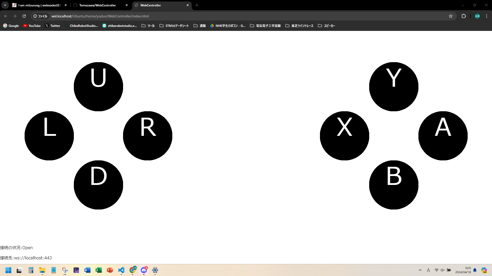

# WebController
html5とjavascriptで動く、ブラウザベースのコントローラーです。



# 使い方
1. コントローラーの受信側(NUCやESP32等)でWebサーバーを立て、コントローラー(操作用ノートPC等)からのhttpリクエストに対し、```index.html```をhttpレスポンスとして返す
1. 受信側で、Webサーバーとは別にWebSocketサーバーを立てる。(ポートは443番を使用)
1. WebSocketサーバーに、各ボタンの状態を示す1バイトの数値が約20Hzで送信される。

## WebSocketに送られるデータの解釈
| ビット | フィールド名 | 内容 | 値 |
| ----- | ----- | ----- | ----- |
| 7 | button_y | Yボタンの状態 | 0: 押されていない, 1: 押されている|
| 6 | button_x | Xボタンの状態 | 同上 |
| 5 | button_b | Bボタンの状態 | 同上 |
| 4 | button_a | Aボタンの状態 | 同上 |
| 3 | button_r | Rボタン(右ボタン)の状態 | 同上 |
| 2 | button_l | Lボタン(左ボタン)の状態 | 同上 |
| 1 | button_d | Dボタン(下ボタン)の状態 | 同上 |
| 0 | button_u | Uボタン(上ボタン)の状態 | 同上 |

## 使用に当たっての注意
WebSocketサーバーが立ってるIPはindex.htmlにべた書きです。したがって、サーバー側はIPを固定するか、index.htmlを返すときに動的にIPを書き換えてください。IPはindex.htmlの```setup()```1行目にある、```host_address```変数にあります。ESP32の場合は多分192.168.1.1(デフォルトゲートウェイ)固定なはず

# ソースコードのドキュメント
後で作る。部品の種類を増やしたり、ボタンを追加したりするのは簡単にできるようになってるはず。